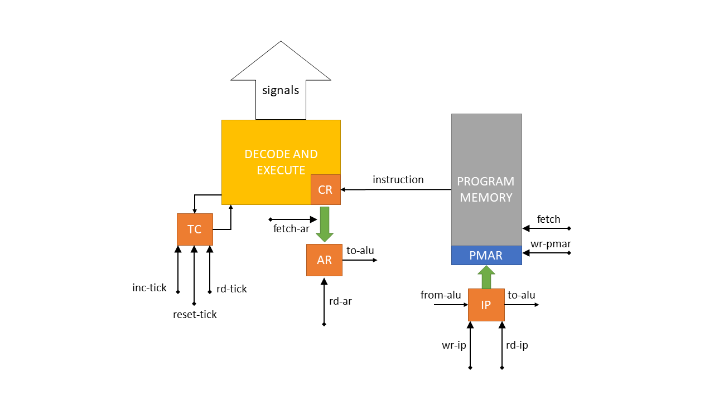

# **Стековый процессор**

- Абузов Ярослав Александрович P33302
- `forth | stack | harv | hw | tick | binary | stream | mem | prob1`


[](https://gitlab.se.ifmo.ru/Zavar30/stack-processor/-/commits/master)
[](https://gitlab.se.ifmo.ru/Zavar30/stack-processor/-/commits/master)

## **Язык программирования**

Форма Бэкуса-Наура для языка Zorth (Forth + Zavar30):

```
<base> ::= <words> | <function> <space> <base>
<word> ::= <number> | <command> | <comment>
<words> ::= <word> <space> <words> | <loop> <space> <words> | <word>
<number> ::= [0-9]+
<command> ::= "+" | "-" | "*" | "/" | "INC" | "DEC" | "AND" | "OR" | "NEG" | "XOR" | "NOT" | "=" 
                  | "!=" | ">" | "<" | "SWAP" | "DROP" | "DUP" | "OVER" | "!" | "@" | "." 
                  | "EMIT" | "IN" | <var> | <name> | ".\"" <space> <string> | <if>
<function> ::= ":" <space> <name> <space> <words> <space> ";"
<loop> ::= "do" <space> <words> <space> "loop"
<if> ::= "if" <space> <words> <space> "endif"
<var> ::= "variable" <space> <name>
<string> ::= ([A-z] | [0-9] | " ")+ "\""
<name> ::= ([A-Z] | [a-z])+
<space> ::= " " | "\n"
<comment> ::= "//" ([A-z] | [0-9] | " ")+
```

- Основное свойство языка - запись всех действий в обратной польской нотации (т.е. 2 + 3 будет выглядеть так: 2 3 +). Основной объект действия команд - стек
- Имеется поддержка математических операторов, логических операторов, операторов сравнения, переменных, циклов, условных операторов и функций
- Все слова языка должны быть разделены пробелом или переносом строки
- Поддерживаются комментарии в формате // comment
- Все функции объявляются в самом начале программы, затем идёт основная программа
- Поддерживаются вложенные циклы и вложенные условные операторы
- Системы типов нет. Все представлено в виде целых чисел. Все команды оперируют со стеком целых чисел
- Переменные имеют глобальную область видимости (после объявления), можно объявить в любом месте программы

### **Детали языка. Положить число на стек**
Для того, чтобы положить число на стек - необходимо просто написать его. По своей сути - числовой литерал

_Пример:_ `6`, теперь 6 лежит на верхушке.

### **Детали языка. Функции**
Для объявления функции необходимо использовать следующий синтаксис: `": <имя> <тело> ;"`. 

_Пример:_ `: sumn d @ n @ d @ / DUP 1 + * * 2 / ;`

Внутри одной функци объявить другую нельзя. Для вызова функции необходимо написать ей имя, например: `ADD sumn 2 3`.

### **Детали языка. Переменные**
Для объявления переменной необходимо использовать следующий синтаксис: `"variable <имя>"`.

_Пример:_ `variable a`

Для получения адреса переменной необходимо написать её имя, на верхушке стека будет адрес переменной.

Для получения значения необходимо использовать следующий синтаксис: `"<имя> @"`. @ - оператор fetch.

_Пример:_ `a @`, теперь значение переменной лежит на верхушке стека.

Для записи значения необходимо использовать следующий синтаксис: `"<значение> <имя> !"`. ! - оператор store. Т.е. значение берется из верхушки стека.

_Пример:_ `15 a !`, теперь 15 хранится в переменной `a`.

### **Детали языка. Циклы**
Цикл будет повторять команды заключенные между `do ... loop`, пока на верхушке стека не 0. Вложенные циклы разрешены.

_Пример:_ `do 2 3 ADD loop`

_Пример:_ `do 1 IN EMIT loop` - бесконечный цикл из программы cat.

### **Детали языка. Условные операторы**
Будут выполнены команды внутри `if ... endif`, если на верхушке стека не 0. Вложенные `if` разрешены.

_Пример:_ `if 4 1 AND if OR * endif = endif`

### **Детали языка. Ввод-вывод**
Для ввод-вывода существуют специальные команды: `.`, `EMIT`, `IN`. Их описание ниже.

Для вывода строкового литерала существует специальная команда `."`. Она выводит идущий за ней строковый литерал.

_Пример:_ `." Hello world!"` - вывести Hello world!, ковычка в конце нужна для обозначения строкового литерала.

### **Детали языка. Описание команд**
| Команда | Стек | Описание |
| ------ | ------ | ------ | 
| + | N1 N2 → (N1 + N2) | Складывает два первых операнда и возвращает сумму на вершину |
| \- | N1 N2 → (N1 \- N2) | Вычитает N1 из N2 и возвращает разность на вершину | 
| \* | N1 N2 → (N1 \* N2) | Умножает два первых элемента и возвращает произведение на вершину |
| / | N1 N2 → (N1 / N2) | Делит N1 на N2 и возвращает целую часть на вершину |
| AND | N1 N2 → (N1 & N2) | Побитовое логическое умножение N1 и N2 |
| OR | N1 N2 → (N1 \| N2) | Побитовое логическое сложение N1 и N2 |
| NEG | N1 → -N1 | Отрицание N1 |
| XOR | N1 N2 → (N1 ^ N2) | «Cложение по модулю 2» N1 и N2 |
| NOT | N1 → !N1 | Побитовое логическое отрицание N1 |
| = | N1 N2 → (N1 == N2) | Проверка на равенство N1 и N2. Если равны, то результат 1, иначе 0 |
| != | N1 N2 → (N1 != N2) | Проверка на неравенство N1 и N2. Если неравны, то результат 1, иначе 0 |
| > | N1 N2 → (N2 > N1) | Проверка, что N2 больше N1. Если так, то результат 1, иначе 0 |
| < | N1 N2 → (N2 < N1) | Проверка, что N2 меньше N1. Если так, то результат 1, иначе 0 |
| INC | N1 → (N1 + 1) | Инкремент N1 |
| DEC | N1 → (N1 - 1) | Декремент N1 |
| SWAP | N1 N2 → N2 N1 | Меняет местами два верхних элемента стека |
| DROP | N1 N2 → N1 | Удаляет N1 из стека |
| DUP | N1 → N1 N1 | Копирует N1 на вершину |
| OVER | N1 N2 → N1 N2 N1 | N1 N2 → N1 N2 N1 |
| ! | N1 ADDR → | Сохраняет N1 по адресу ADDR в памяти данных |
| @ | ADDR → N1 | Считывает значение из памяти данных по адресу ADDR и возвращает его в N1 на вершину |
| . | N1 → | Выводит вершину стека в output |
| EMIT | N1 → | Выводит вершину стека в output как символ |
| IN | → N1 | Считывает значение из input |

## **Организация памяти**
### **Как язык позволяет работать с памятью**
- Язык работает со стеком и с памятью данных
- Как таковых именованных констант нет
- Существуют числовые и строковые литералы (см. детали языка выше)
- Возможно объявить переменную (см. детали языка выше)
- Возможно получить адрес (ссылку) переменной (см. детали языка выше)
- Вся память статическая, динамического выделения нет
- Scope всех переменных - глобальный

### **Модель памяти процессора**
Память разделена на две группы - стековая и обычная. Стековая память существует в двух видах: стек данных и стек возврата. Первый используется для вычислений (машинное слово 32 бита, знаковое), второй для хранения адресов возврата из функций (машинное слово 32 бита, беззнаковое). У стека данных вершина вынесена в отдельных регистр `TOS`, а второй элемент стека находится в самом стеке на его вершине. Реализованы с помощью Stack.

Модель обычной памяти - Гарвардская т.е. разделена на память данных и память программы. Память программы является read-only после записи в нее программы. 

- Память программы: 16777215 (2^24 - 1) ячеек, машинное слово 32 бита, беззнаковое. Адресное пространство линейное, реализовано с помощью ArrayList.
- Память данных: 4096 ячеек, машинное слово 32 бита, знаковое. Адресное пространство линейное, реализовано с помощью ArrayList.

_P.S. Адрес задаётся 24 битами, поэтому его максимальное значение (2^24 - 1). Память данных ограничена только этим значением, поэтому легко может быть расширена. Размер в 4096 ячеек был выбран для уменьшения потребляемой памяти симулятора_

### **Как транслятор отображает конструкции языка на память**
В памяти данных сначала идут литералы, затем переменные. Однако первых три адреса занято под IO. 

В памяти команд сначала идёт основная программа, затем идут функции. Основная программа обязательно заканчивается HALT.

```
Data memory
+-----------------------------+
| 00  : IO byte out           |
| 01  : IO in                 |
| 02  : IO char out           |
| 03  : lit 1                 |
| 04  : lit 2                 |
|    ...                      | 
| n   : var 1                 |
| n+1 : var 2                 |
|    ...                      |
| 4096: end of data memory    |
+-----------------------------+

Program memory
+-----------------------------+
| 00  : main program start    |
|    ...                      |
| n   : end of main program   |
| n+1 : function 1 start      |
|    ...                      |
| k   : end of function 1     |
| k+1 : function 2 start      |
|    ...                      |
| m   : end of function 2     |
+-----------------------------+
```

## **Система команд**
### **Особенности процессора**

- ALU
    - Имеет два входа (левый и правый) и один выход. Выбираются через мультиплексоры и соотв. сигналы
    - Поддерживает множество операций ([Alu.java](https://gitlab.se.ifmo.ru/Zavar30/stack-processor/-/blob/master/processor/src/main/java/ru/itmo/zavar/alu/Alu.java)), которые выбираются с помощью сигнала ([AluOperation.java](https://gitlab.se.ifmo.ru/Zavar30/stack-processor/-/blob/master/processor/src/main/java/ru/itmo/zavar/alu/AluOperation.java))
- Data stack
    - Можно положить на стек или снять с него значение
    - Регистр DS (32 бита) содержит второй сверху элемент
    - Регистр TOS (32 бита) содержит вершину стека
- Return stack
    - Можно положить на стек или снять с него значение
    - Регистр RS (32 бита) содержит вершину стека
- Data memory 
    - Можно записать или считать значение по адресу ([Memory.java](https://gitlab.se.ifmo.ru/Zavar30/stack-processor/-/blob/master/processor/src/main/java/ru/itmo/zavar/base/mem/Memory.java))
    - Регистр DMAR (24 бита) отображает адрес
    - Первые три ячейки отведены для IO (0 - байтовый вывод, 1 - ввод, 2 - символьный вывод)
    - Определением с чем работать - с IO или памятью - занимается контроллер памяти ([DataMemoryController.java](https://gitlab.se.ifmo.ru/Zavar30/stack-processor/-/blob/master/processor/src/main/java/ru/itmo/zavar/base/mem/DataMemoryController.java))
- Program memory
    - Можно считывать команды по адресу (read-only) ([ProtectedMemory.java](https://gitlab.se.ifmo.ru/Zavar30/stack-processor/-/blob/master/processor/src/main/java/ru/itmo/zavar/base/mem/ProtectedMemory.java))
    - Регистр PMAR (24 бита) отображает адрес
    - PMAR связан с регистром IP (24 бита)
    - Значение команды попадает сразу в регистр CR (32 бита)
- Регистр AR (address registry)
    - 24 бита, беззнаковый
    - Хранит адрес, нужен для адресных инструкций
    - Связан с CR 
- Регистр IP (instruction pointer)
    - 24 бита, беззнаковый
    - Указывает на следующую инструкцию
    - Связан с PMAR
- Регистр TOS (top of stack)
    - 32 бита, знаковый
    - Хранит вершину Data stack
    - Можно посмотреть знак (флаг N) и равен ли он нулю (флаг Z)
- Регистр TC (tick counter)
    - Считает тики во время этапов исполнения команд
    - Нужен в первую очередь для отладки

Все соединения отображены на схеме.

### **Цикл выполнения инструкции**
Цикл состоит из трёх этапов:
- [Fetch next instruction](https://gitlab.se.ifmo.ru/Zavar30/stack-processor/-/blob/master/processor/src/main/java/ru/itmo/zavar/comp/ControlUnit.java#L147) (загрузка следующей инструкции)
    - PMAR ← IP
    - СR ← PMEMORY
    - IP ← IP + 1
- [Fetch address](https://gitlab.se.ifmo.ru/Zavar30/stack-processor/-/blob/master/processor/src/main/java/ru/itmo/zavar/comp/ControlUnit.java#L136) (загрузка адреса из кода инструкции в AR, если инструкция адресная)
    - AR ← CR (0..23)
- [Execute](https://gitlab.se.ifmo.ru/Zavar30/stack-processor/-/blob/master/processor/src/main/java/ru/itmo/zavar/comp/ControlUnit.java#L156) (выполнение)
    - Такты самой инструкции

### **Кодирование инструкций**
Формат кодирования - бинарный. Слово - 32 бита, беззнаковое.

Старшие 8 бит отведены под код команды, при этом 7й бит отведен под тип команды. 0 - команда безадресная. 1 - команда адресная. Младшие 24 бита отведены под адрес в адресный командах, в безадресных эти биты равны 0.

### **Система команд**

В бинарном формате указаны только старшие 8 бит. Про младшие 24 бита описано выше.

| Мнемоника | Бинарный формат | Кол-во тактов | Описание |
| ------ | ------ | ------ | ------ |
| HALT | 00000000 | 3+1 | Останов |
| ADD | 00000010 | 3+1 | см. язык |
| SUB | 00000100 | 3+1 | см. язык |
| MUL | 00000110 | 3+1 | см. язык |
| DIV | 00001000 | 3+1 | см. язык |
| AND | 00001010 | 3+1 | см. язык |
| OR | 00001100 | 3+1 | см. язык |
| NEG | 00001110 | 3+1 | см. язык |
| XOR | 00010000 | 3+1 | см. язык |
| EQ | 00010010 | 3+1 | см. язык (=) |
| GR | 00010100 | 3+1 | см. язык (>) |
| LE | 00010110 | 3+1 | см. язык (<) |
| DROP | 00011000 | 3+1 | см. язык |
| DUP | 00011010 | 3+1 | см. язык |
| OVER | 00011110 | 3+4 | см. язык |
| SWAP | 00100000 | 3+3 | см. язык |
| >R | 00100010 | 3+2 | Поместить веришну DS на RS |
| R> | 00100100 | 3+2 | Поместить веришну RS на DS |
| ! | 00100110 | 3+3 | см. язык |
| @ | 00101000 | 3+2 | см. язык |
| [LIT] addr | 00101011 | 3+1+3 | Загрузить литерал на вершину по адресу |
| [JMP] addr | 00101101 | 3+1+1 | Безусловный переход по адресу |
| [IF] addr | 00101111 | 3+1+2/1 | Переход по адресу, если на вершине 0 |
| [CALL] addr | 00110001 | 3+1+2 | Вывзов функции по адресу |
| [LOOP] addr | 00110011 | 3+1+2/1 | Переход по адресу пока на вершине не 0 |
| NOPE | 00110100 | 3+1 | Нет операции |
| EXIT | 00110110 | 3+1 | см. язык |
| NOT | 00111000 | 3+1 | см. язык |
| [ADDR] addr | 00111011 | 3+1+2 | Загрузить адрес из AR в TOS |
| INC | 00111100 | 3+1 | см. язык |
| DEC | 00111110 | 3+1 | см. язык |
| NEQ | 01000000 | 3+1 | см. язык |

Кол-во тактов: fetch+addr+exec или fetch+exec

Подробнее [InstructionCode.java](https://gitlab.se.ifmo.ru/Zavar30/stack-processor/-/blob/master/common/src/main/java/ru/itmo/zavar/InstructionCode.java)

## **Транслятор**
Реализовано здесь: [ZorthTranslator.java](https://gitlab.se.ifmo.ru/Zavar30/stack-processor/-/blob/master/translator/src/main/java/ru/itmo/zavar/zorth/ZorthTranslator.java)

Интерфейс командной строки:
```
usage: translator.jar
 -d,--debug <arg>    debug
 -f,--format <arg>   output file format
 -i,--input <arg>    input file path
 -o,--output <arg>   output path
```

Глобально трансляция проходит за два этапа: компиляцию и линковку.

1. Компиляция
    - Проход по всей исходной программе
    - Преобразование примитивов Zorth в инструкции процессора (правила ниже)
    - Формирование таблиц линковки для функций, литералов и переменных с 0 адресами
    - Установка заглущек с метками на адресные команды
    - Разделение кода функций и основной программы
    - Проверка синтаксических ошибок и вывод сообщений о них
2. Линковка
    - Установка адресов в таблицах линковки
    - Размещение в памяти литералов и переменных
    - Установка валидных адресов вместо заглушек в основной программе
    - Соединение основной программы и функций

Часть программы prob1:
```
sumn
5 d !
sumn
+
3 5 * d !
sumn
-
```

Пример скомпилированной части программы (в мнемониках):
```
[CALL] fun$sumn
[LIT] lit$5
[ADDR] var$d
! 
[CALL] fun$sumn
ADD 
[LIT] lit$3
[LIT] lit$5
MUL 
[ADDR] var$d
! 
[CALL] fun$sumn
SUB
```

Пример слинкованной части программы:
```
[CALL] 26
[LIT] 6
[ADDR] 7
! 
[CALL] 26
ADD 
[LIT] 5
[LIT] 6
MUL 
[ADDR] 7
! 
[CALL] 26
SUB 
```
### **Правила трансляции**

- Примитивы Zorth могут быть отражены в команды процессора напрямую (например, '+', '-', 'AND') или последоватльностью из несольких команд ('.', 'EMIT').
- В конце основной программы HALT
- В конце функций EXIT
- Каждый символ строкового литерала упаковывается в отдельную ячейку как числовой литерал
- Для загрузки литерала lit$n: n - адрес литерала в памяти данных
- Для переменной var$n: n - адрес переменной в памяти данных
- Для функции fun$n: n - адрес прыжка в памяти программы
- Для цикла loop$n: n - на сколько шагов назад необходимо прыгуть относительно [LOOP] в памяти программы т.е. адрес будет равен адрес ([LOOP] - n)
- Для условий if$n: n - адрес в памяти программы на который нужно прыгнуть в случае 0 на вершине

Итоговая программа может быть упакована в бинарный формат или текстовый формат с мнемониками.

Примеры программ: [resources](https://gitlab.se.ifmo.ru/Zavar30/stack-processor/-/tree/master/report/src/main/resources)

## **Модель процессора**
### **DataPath**


Реализовано здесь: [DataPath.java](https://gitlab.se.ifmo.ru/Zavar30/stack-processor/-/blob/master/processor/src/main/java/ru/itmo/zavar/comp/DataPath.java)

Составные компоненты описаны выше.

Сигналы (выполняются за один такт):
- С префиксом oe - сигнал output enable для соотв. памяти
- С префиксом wr - сигнал на запись для соотв. памяти или регистра
- С префиксом rd - сигнал на чтение соотв. регистра
- sel-lalu - выбор левого входа ALU
- sel-ralu - выбор правого входа ALU
- sel-out - выбор выхода ALU
- sel-op - выбор операции ALU

Сигналы реализованы с помощью методов в классе [DataPath.java](https://gitlab.se.ifmo.ru/Zavar30/stack-processor/-/blob/master/processor/src/main/java/ru/itmo/zavar/comp/DataPath.java). Мультиплексоры реализованы с помощью enum здесь [mux](https://gitlab.se.ifmo.ru/Zavar30/stack-processor/-/tree/master/processor/src/main/java/ru/itmo/zavar/base/mux).

Флаги:
- Z - проверить TOS на 0
- N - знак TOS 


### **ControlUnit**


Реализовано здесь: [ControlUnit.java](https://gitlab.se.ifmo.ru/Zavar30/stack-processor/-/blob/master/processor/src/main/java/ru/itmo/zavar/comp/ControlUnit.java)

- Hardwired, реализовано полностью на Java 17 (использованы новые возможности выпущенные после 8 версии)
- Моделирование на уровне тиков
- Составные компоненты описаны выше 
- Цикл выполнения команды описан выше
- Класс предоставляет доступ к журналу моделирования (можно отключить), где можно посмотреть программно каждый тик и состояние каждого регистра в этот тик и т.д.
- Моделирование может быть остановлено при выбрасывании исключений: [exception](https://gitlab.se.ifmo.ru/Zavar30/stack-processor/-/tree/master/processor/src/main/java/ru/itmo/zavar/exception)
    - OutOfInputException - токены на входе закончились
    - RsEmpty - RS стек пуст
    - DsEmpty - DS стек пуст
    - InvalidInstructionException - невалидный код инструкции
    - ReservedInstructionException - получен код зарезервированной инструкции
    - MemoryCellConstraintException - превышен лимит ячейки памяти
    - RegisterConstraintException - превышен лимит значения регистра
    - InvalidMuxSelectionException - не соотв. желаемый и выбранный вход/вызод (служебное исключение, защита от дурака)
- Моделирование останавливается после инструкции HALT

Сигналы (выполняются за один тик):
- С префиксом wr - сигнал на запись для соотв. памяти или регистра
- С префиксом rd - сигнал на чтение соотв. регистра
- fetch - считать из программной памяти и поместить в CR
- fetch-ar - поместить из CR в AR адрес
- inc-tick - инкрементировать TC
- reset-tick - сбросить TC

### **Интерфейс командной строки**
```
usage: processor.jar
 -d,--data <arg>      data path
 -dg,--debug <arg>    debug
 -i,--input <arg>     input path
 -p,--program <arg>   program path
```

## **Апробация**

- Пачка тестов для проверки всех инструкция процессора, ограничений памяти и исключений: [processor tests](https://gitlab.se.ifmo.ru/Zavar30/stack-processor/-/tree/master/processor/src/test/java/ru/itmo/zavar)
- Тесты для транслятора: [translator tests](https://gitlab.se.ifmo.ru/Zavar30/stack-processor/-/tree/master/translator/src/test/java)
- Интеграционные тесты (hello, cat, prob1): [integration tests](https://gitlab.se.ifmo.ru/Zavar30/stack-processor/-/tree/master/report/src/test/java/ru/itmo/zavar/integration)

### **Программы для тестирования**

1. [hello.zorth](https://gitlab.se.ifmo.ru/Zavar30/stack-processor/-/blob/master/report/src/main/resources/hello.zorth) - выводит Hello world!
2. [cat.zorth](https://gitlab.se.ifmo.ru/Zavar30/stack-processor/-/blob/master/report/src/main/resources/cat.zorth) - программа cat (повторяет ввод на выводе)
3. [prob1.zorth](https://gitlab.se.ifmo.ru/Zavar30/stack-processor/-/blob/master/report/src/main/resources/prob1.zorth) - Euler problem 1

### **Описание CI**

GitLab CI config: [.gitlab-ci.yml](https://gitlab.se.ifmo.ru/Zavar30/stack-processor/-/blob/master/.gitlab-ci.yml)

Parent Maven config: [parent pom.xml](https://gitlab.se.ifmo.ru/Zavar30/stack-processor/-/blob/master/pom.xml)

- JUnit - фреймворк для тестирования
- Jacoco - maven плагин для подсчёта покрытия кода тестами (результат в шапке)
- Checkstyle - maven плагин для проверки стиля кода
- Spotbugs - maven плагин для проверки качества кода

Для запуска тестов, подсчёта покрытия и проверки стиля необходимо запустить: `mvn verify`

Для проверки качества кода необходимо запустить: `mvn spotbugs:check`

Все плагины подключен и настроены в pom.xml (Maven config), GitLab CI осуществляет только запуск и вывод информации.

Docker образ для запуска java и maven: [Dockerfile](https://gitlab.se.ifmo.ru/Zavar30/stack-processor/-/blob/master/Dockerfile)

### **Пример работы с cat.zorth**

```
> cd translator/target/
> cat ./cat.zorth
do
1
IN
EMIT
loop
> java -jar translator.jar -d true -f mne -i ./cat.zorth -o ./cat/output
COMPILATION:

Compiled main:
[LIT] lit$1
[ADDR] 1
@ 
[ADDR] 2
! 
[LOOP] loop$5
HALT 
Compiled functions:

Function table:

Literal table:
1, address:0

Var table:

LINKAGE:


Function table:

Literal table:
1, address:3

Var table:

Program:
[LIT] 3
[ADDR] 1
@ 
[ADDR] 2
! 
[LOOP] 0
HALT 
> java -jar translator.jar -d false -f bin -i ./cat.zorth -o ./cat/output
> cd processor/target/
> cat ./input
{
    "tokens": ["f", "o", "o", "\n"]
}
> java -jar processor.jar -db true -p ./compiled.bin -d ./data.dbin -i ./input
Tick: 1, TC: 1, Stage: FETCH, CR: 872415232 {NOPE}, IP: 0, AR: 0, TOS: 0, DS: null, RS: null, OUT: null, IN: f
Tick: 2, TC: 2, Stage: FETCH, CR: 721420291 {LIT}, IP: 0, AR: 0, TOS: 0, DS: null, RS: null, OUT: null, IN: f
Tick: 3, TC: 3, Stage: FETCH, CR: 721420291 {LIT}, IP: 1, AR: 0, TOS: 0, DS: null, RS: null, OUT: null, IN: f
Tick: 4, TC: 1, Stage: ADDRESS, CR: 721420291 {LIT}, IP: 1, AR: 3, TOS: 0, DS: null, RS: null, OUT: null, IN: f
Tick: 5, TC: 1, Stage: EXECUTE, CR: 721420291 {LIT}, IP: 1, AR: 3, TOS: 0, DS: null, RS: null, OUT: null, IN: f
Tick: 6, TC: 2, Stage: EXECUTE, CR: 721420291 {LIT}, IP: 1, AR: 3, TOS: 0, DS: 0, RS: null, OUT: null, IN: f
Tick: 7, TC: 3, Stage: EXECUTE, CR: 721420291 {LIT}, IP: 1, AR: 3, TOS: 1, DS: 0, RS: null, OUT: null, IN: f

Tick: 8, TC: 1, Stage: FETCH, CR: 721420291 {LIT}, IP: 1, AR: 3, TOS: 1, DS: 0, RS: null, OUT: null, IN: f
Tick: 9, TC: 2, Stage: FETCH, CR: 989855745 {ADDR}, IP: 1, AR: 3, TOS: 1, DS: 0, RS: null, OUT: null, IN: f
Tick: 10, TC: 3, Stage: FETCH, CR: 989855745 {ADDR}, IP: 2, AR: 3, TOS: 1, DS: 0, RS: null, OUT: null, IN: f
Tick: 11, TC: 1, Stage: ADDRESS, CR: 989855745 {ADDR}, IP: 2, AR: 1, TOS: 1, DS: 0, RS: null, OUT: null, IN: f
Tick: 12, TC: 1, Stage: EXECUTE, CR: 989855745 {ADDR}, IP: 2, AR: 1, TOS: 1, DS: 1, RS: null, OUT: null, IN: f
Tick: 13, TC: 2, Stage: EXECUTE, CR: 989855745 {ADDR}, IP: 2, AR: 1, TOS: 1, DS: 1, RS: null, OUT: null, IN: f

Tick: 14, TC: 1, Stage: FETCH, CR: 989855745 {ADDR}, IP: 2, AR: 1, TOS: 1, DS: 1, RS: null, OUT: null, IN: f
Tick: 15, TC: 2, Stage: FETCH, CR: 671088640 {FT}, IP: 2, AR: 1, TOS: 1, DS: 1, RS: null, OUT: null, IN: f
Tick: 16, TC: 3, Stage: FETCH, CR: 671088640 {FT}, IP: 3, AR: 1, TOS: 1, DS: 1, RS: null, OUT: null, IN: f
Tick: 17, TC: 1, Stage: EXECUTE, CR: 671088640 {FT}, IP: 3, AR: 1, TOS: 1, DS: 1, RS: null, OUT: null, IN: f
Tick: 18, TC: 2, Stage: EXECUTE, CR: 671088640 {FT}, IP: 3, AR: 1, TOS: 102, DS: 1, RS: null, OUT: null, IN: o

Tick: 19, TC: 1, Stage: FETCH, CR: 671088640 {FT}, IP: 3, AR: 1, TOS: 102, DS: 1, RS: null, OUT: null, IN: o
Tick: 20, TC: 2, Stage: FETCH, CR: 989855746 {ADDR}, IP: 3, AR: 1, TOS: 102, DS: 1, RS: null, OUT: null, IN: o
Tick: 21, TC: 3, Stage: FETCH, CR: 989855746 {ADDR}, IP: 4, AR: 1, TOS: 102, DS: 1, RS: null, OUT: null, IN: o
Tick: 22, TC: 1, Stage: ADDRESS, CR: 989855746 {ADDR}, IP: 4, AR: 2, TOS: 102, DS: 1, RS: null, OUT: null, IN: o
Tick: 23, TC: 1, Stage: EXECUTE, CR: 989855746 {ADDR}, IP: 4, AR: 2, TOS: 102, DS: 102, RS: null, OUT: null, IN: o
Tick: 24, TC: 2, Stage: EXECUTE, CR: 989855746 {ADDR}, IP: 4, AR: 2, TOS: 2, DS: 102, RS: null, OUT: null, IN: o

Tick: 25, TC: 1, Stage: FETCH, CR: 989855746 {ADDR}, IP: 4, AR: 2, TOS: 2, DS: 102, RS: null, OUT: null, IN: o
Tick: 26, TC: 2, Stage: FETCH, CR: 637534208 {ST}, IP: 4, AR: 2, TOS: 2, DS: 102, RS: null, OUT: null, IN: o
Tick: 27, TC: 3, Stage: FETCH, CR: 637534208 {ST}, IP: 5, AR: 2, TOS: 2, DS: 102, RS: null, OUT: null, IN: o
Tick: 28, TC: 1, Stage: EXECUTE, CR: 637534208 {ST}, IP: 5, AR: 2, TOS: 2, DS: 102, RS: null, OUT: null, IN: o
Tick: 29, TC: 2, Stage: EXECUTE, CR: 637534208 {ST}, IP: 5, AR: 2, TOS: 2, DS: 1, RS: null, OUT: f, IN: o
Tick: 30, TC: 3, Stage: EXECUTE, CR: 637534208 {ST}, IP: 5, AR: 2, TOS: 1, DS: 0, RS: null, OUT: f, IN: o

Tick: 31, TC: 1, Stage: FETCH, CR: 637534208 {ST}, IP: 5, AR: 2, TOS: 1, DS: 0, RS: null, OUT: f, IN: o
Tick: 32, TC: 2, Stage: FETCH, CR: 855638016 {LOOP}, IP: 5, AR: 2, TOS: 1, DS: 0, RS: null, OUT: f, IN: o
Tick: 33, TC: 3, Stage: FETCH, CR: 855638016 {LOOP}, IP: 6, AR: 2, TOS: 1, DS: 0, RS: null, OUT: f, IN: o
Tick: 34, TC: 1, Stage: ADDRESS, CR: 855638016 {LOOP}, IP: 6, AR: 0, TOS: 1, DS: 0, RS: null, OUT: f, IN: o
Tick: 35, TC: 1, Stage: EXECUTE, CR: 855638016 {LOOP}, IP: 6, AR: 0, TOS: 0, DS: 0, RS: null, OUT: f, IN: o
Tick: 36, TC: 2, Stage: EXECUTE, CR: 855638016 {LOOP}, IP: 0, AR: 0, TOS: 0, DS: 0, RS: null, OUT: f, IN: o

Tick: 37, TC: 1, Stage: FETCH, CR: 855638016 {LOOP}, IP: 0, AR: 0, TOS: 0, DS: 0, RS: null, OUT: f, IN: o
Tick: 38, TC: 2, Stage: FETCH, CR: 721420291 {LIT}, IP: 0, AR: 0, TOS: 0, DS: 0, RS: null, OUT: f, IN: o
Tick: 39, TC: 3, Stage: FETCH, CR: 721420291 {LIT}, IP: 1, AR: 0, TOS: 0, DS: 0, RS: null, OUT: f, IN: o
Tick: 40, TC: 1, Stage: ADDRESS, CR: 721420291 {LIT}, IP: 1, AR: 3, TOS: 0, DS: 0, RS: null, OUT: f, IN: o
Tick: 41, TC: 1, Stage: EXECUTE, CR: 721420291 {LIT}, IP: 1, AR: 3, TOS: 0, DS: 0, RS: null, OUT: f, IN: o
Tick: 42, TC: 2, Stage: EXECUTE, CR: 721420291 {LIT}, IP: 1, AR: 3, TOS: 0, DS: 0, RS: null, OUT: f, IN: o
Tick: 43, TC: 3, Stage: EXECUTE, CR: 721420291 {LIT}, IP: 1, AR: 3, TOS: 1, DS: 0, RS: null, OUT: f, IN: o

Tick: 44, TC: 1, Stage: FETCH, CR: 721420291 {LIT}, IP: 1, AR: 3, TOS: 1, DS: 0, RS: null, OUT: f, IN: o
Tick: 45, TC: 2, Stage: FETCH, CR: 989855745 {ADDR}, IP: 1, AR: 3, TOS: 1, DS: 0, RS: null, OUT: f, IN: o
Tick: 46, TC: 3, Stage: FETCH, CR: 989855745 {ADDR}, IP: 2, AR: 3, TOS: 1, DS: 0, RS: null, OUT: f, IN: o
Tick: 47, TC: 1, Stage: ADDRESS, CR: 989855745 {ADDR}, IP: 2, AR: 1, TOS: 1, DS: 0, RS: null, OUT: f, IN: o
Tick: 48, TC: 1, Stage: EXECUTE, CR: 989855745 {ADDR}, IP: 2, AR: 1, TOS: 1, DS: 1, RS: null, OUT: f, IN: o
Tick: 49, TC: 2, Stage: EXECUTE, CR: 989855745 {ADDR}, IP: 2, AR: 1, TOS: 1, DS: 1, RS: null, OUT: f, IN: o

Tick: 50, TC: 1, Stage: FETCH, CR: 989855745 {ADDR}, IP: 2, AR: 1, TOS: 1, DS: 1, RS: null, OUT: f, IN: o
Tick: 51, TC: 2, Stage: FETCH, CR: 671088640 {FT}, IP: 2, AR: 1, TOS: 1, DS: 1, RS: null, OUT: f, IN: o
Tick: 52, TC: 3, Stage: FETCH, CR: 671088640 {FT}, IP: 3, AR: 1, TOS: 1, DS: 1, RS: null, OUT: f, IN: o
Tick: 53, TC: 1, Stage: EXECUTE, CR: 671088640 {FT}, IP: 3, AR: 1, TOS: 1, DS: 1, RS: null, OUT: f, IN: o
Tick: 54, TC: 2, Stage: EXECUTE, CR: 671088640 {FT}, IP: 3, AR: 1, TOS: 111, DS: 1, RS: null, OUT: f, IN: o

Tick: 55, TC: 1, Stage: FETCH, CR: 671088640 {FT}, IP: 3, AR: 1, TOS: 111, DS: 1, RS: null, OUT: f, IN: o
Tick: 56, TC: 2, Stage: FETCH, CR: 989855746 {ADDR}, IP: 3, AR: 1, TOS: 111, DS: 1, RS: null, OUT: f, IN: o
Tick: 57, TC: 3, Stage: FETCH, CR: 989855746 {ADDR}, IP: 4, AR: 1, TOS: 111, DS: 1, RS: null, OUT: f, IN: o
Tick: 58, TC: 1, Stage: ADDRESS, CR: 989855746 {ADDR}, IP: 4, AR: 2, TOS: 111, DS: 1, RS: null, OUT: f, IN: o
Tick: 59, TC: 1, Stage: EXECUTE, CR: 989855746 {ADDR}, IP: 4, AR: 2, TOS: 111, DS: 111, RS: null, OUT: f, IN: o
Tick: 60, TC: 2, Stage: EXECUTE, CR: 989855746 {ADDR}, IP: 4, AR: 2, TOS: 2, DS: 111, RS: null, OUT: f, IN: o

Tick: 61, TC: 1, Stage: FETCH, CR: 989855746 {ADDR}, IP: 4, AR: 2, TOS: 2, DS: 111, RS: null, OUT: f, IN: o
Tick: 62, TC: 2, Stage: FETCH, CR: 637534208 {ST}, IP: 4, AR: 2, TOS: 2, DS: 111, RS: null, OUT: f, IN: o
Tick: 63, TC: 3, Stage: FETCH, CR: 637534208 {ST}, IP: 5, AR: 2, TOS: 2, DS: 111, RS: null, OUT: f, IN: o
Tick: 64, TC: 1, Stage: EXECUTE, CR: 637534208 {ST}, IP: 5, AR: 2, TOS: 2, DS: 111, RS: null, OUT: f, IN: o
Tick: 65, TC: 2, Stage: EXECUTE, CR: 637534208 {ST}, IP: 5, AR: 2, TOS: 2, DS: 1, RS: null, OUT: fo, IN: o
Tick: 66, TC: 3, Stage: EXECUTE, CR: 637534208 {ST}, IP: 5, AR: 2, TOS: 1, DS: 0, RS: null, OUT: fo, IN: o

Tick: 67, TC: 1, Stage: FETCH, CR: 637534208 {ST}, IP: 5, AR: 2, TOS: 1, DS: 0, RS: null, OUT: fo, IN: o
Tick: 68, TC: 2, Stage: FETCH, CR: 855638016 {LOOP}, IP: 5, AR: 2, TOS: 1, DS: 0, RS: null, OUT: fo, IN: o
Tick: 69, TC: 3, Stage: FETCH, CR: 855638016 {LOOP}, IP: 6, AR: 2, TOS: 1, DS: 0, RS: null, OUT: fo, IN: o
Tick: 70, TC: 1, Stage: ADDRESS, CR: 855638016 {LOOP}, IP: 6, AR: 0, TOS: 1, DS: 0, RS: null, OUT: fo, IN: o
Tick: 71, TC: 1, Stage: EXECUTE, CR: 855638016 {LOOP}, IP: 6, AR: 0, TOS: 0, DS: 0, RS: null, OUT: fo, IN: o
Tick: 72, TC: 2, Stage: EXECUTE, CR: 855638016 {LOOP}, IP: 0, AR: 0, TOS: 0, DS: 0, RS: null, OUT: fo, IN: o

Tick: 73, TC: 1, Stage: FETCH, CR: 855638016 {LOOP}, IP: 0, AR: 0, TOS: 0, DS: 0, RS: null, OUT: fo, IN: o
Tick: 74, TC: 2, Stage: FETCH, CR: 721420291 {LIT}, IP: 0, AR: 0, TOS: 0, DS: 0, RS: null, OUT: fo, IN: o
Tick: 75, TC: 3, Stage: FETCH, CR: 721420291 {LIT}, IP: 1, AR: 0, TOS: 0, DS: 0, RS: null, OUT: fo, IN: o
Tick: 76, TC: 1, Stage: ADDRESS, CR: 721420291 {LIT}, IP: 1, AR: 3, TOS: 0, DS: 0, RS: null, OUT: fo, IN: o
Tick: 77, TC: 1, Stage: EXECUTE, CR: 721420291 {LIT}, IP: 1, AR: 3, TOS: 0, DS: 0, RS: null, OUT: fo, IN: o
Tick: 78, TC: 2, Stage: EXECUTE, CR: 721420291 {LIT}, IP: 1, AR: 3, TOS: 0, DS: 0, RS: null, OUT: fo, IN: o
Tick: 79, TC: 3, Stage: EXECUTE, CR: 721420291 {LIT}, IP: 1, AR: 3, TOS: 1, DS: 0, RS: null, OUT: fo, IN: o

Tick: 80, TC: 1, Stage: FETCH, CR: 721420291 {LIT}, IP: 1, AR: 3, TOS: 1, DS: 0, RS: null, OUT: fo, IN: o
Tick: 81, TC: 2, Stage: FETCH, CR: 989855745 {ADDR}, IP: 1, AR: 3, TOS: 1, DS: 0, RS: null, OUT: fo, IN: o
Tick: 82, TC: 3, Stage: FETCH, CR: 989855745 {ADDR}, IP: 2, AR: 3, TOS: 1, DS: 0, RS: null, OUT: fo, IN: o
Tick: 83, TC: 1, Stage: ADDRESS, CR: 989855745 {ADDR}, IP: 2, AR: 1, TOS: 1, DS: 0, RS: null, OUT: fo, IN: o
Tick: 84, TC: 1, Stage: EXECUTE, CR: 989855745 {ADDR}, IP: 2, AR: 1, TOS: 1, DS: 1, RS: null, OUT: fo, IN: o
Tick: 85, TC: 2, Stage: EXECUTE, CR: 989855745 {ADDR}, IP: 2, AR: 1, TOS: 1, DS: 1, RS: null, OUT: fo, IN: o

Tick: 86, TC: 1, Stage: FETCH, CR: 989855745 {ADDR}, IP: 2, AR: 1, TOS: 1, DS: 1, RS: null, OUT: fo, IN: o
Tick: 87, TC: 2, Stage: FETCH, CR: 671088640 {FT}, IP: 2, AR: 1, TOS: 1, DS: 1, RS: null, OUT: fo, IN: o
Tick: 88, TC: 3, Stage: FETCH, CR: 671088640 {FT}, IP: 3, AR: 1, TOS: 1, DS: 1, RS: null, OUT: fo, IN: o
Tick: 89, TC: 1, Stage: EXECUTE, CR: 671088640 {FT}, IP: 3, AR: 1, TOS: 1, DS: 1, RS: null, OUT: fo, IN: o
Tick: 90, TC: 2, Stage: EXECUTE, CR: 671088640 {FT}, IP: 3, AR: 1, TOS: 111, DS: 1, RS: null, OUT: fo, IN: \n

Tick: 91, TC: 1, Stage: FETCH, CR: 671088640 {FT}, IP: 3, AR: 1, TOS: 111, DS: 1, RS: null, OUT: fo, IN: \n
Tick: 92, TC: 2, Stage: FETCH, CR: 989855746 {ADDR}, IP: 3, AR: 1, TOS: 111, DS: 1, RS: null, OUT: fo, IN: \n
Tick: 93, TC: 3, Stage: FETCH, CR: 989855746 {ADDR}, IP: 4, AR: 1, TOS: 111, DS: 1, RS: null, OUT: fo, IN: \n
Tick: 94, TC: 1, Stage: ADDRESS, CR: 989855746 {ADDR}, IP: 4, AR: 2, TOS: 111, DS: 1, RS: null, OUT: fo, IN: \n
Tick: 95, TC: 1, Stage: EXECUTE, CR: 989855746 {ADDR}, IP: 4, AR: 2, TOS: 111, DS: 111, RS: null, OUT: fo, IN: \n
Tick: 96, TC: 2, Stage: EXECUTE, CR: 989855746 {ADDR}, IP: 4, AR: 2, TOS: 2, DS: 111, RS: null, OUT: fo, IN: \n

Tick: 97, TC: 1, Stage: FETCH, CR: 989855746 {ADDR}, IP: 4, AR: 2, TOS: 2, DS: 111, RS: null, OUT: fo, IN: \n
Tick: 98, TC: 2, Stage: FETCH, CR: 637534208 {ST}, IP: 4, AR: 2, TOS: 2, DS: 111, RS: null, OUT: fo, IN: \n
Tick: 99, TC: 3, Stage: FETCH, CR: 637534208 {ST}, IP: 5, AR: 2, TOS: 2, DS: 111, RS: null, OUT: fo, IN: \n
Tick: 100, TC: 1, Stage: EXECUTE, CR: 637534208 {ST}, IP: 5, AR: 2, TOS: 2, DS: 111, RS: null, OUT: fo, IN: \n
Tick: 101, TC: 2, Stage: EXECUTE, CR: 637534208 {ST}, IP: 5, AR: 2, TOS: 2, DS: 1, RS: null, OUT: foo, IN: \n
Tick: 102, TC: 3, Stage: EXECUTE, CR: 637534208 {ST}, IP: 5, AR: 2, TOS: 1, DS: 0, RS: null, OUT: foo, IN: \n

Tick: 103, TC: 1, Stage: FETCH, CR: 637534208 {ST}, IP: 5, AR: 2, TOS: 1, DS: 0, RS: null, OUT: foo, IN: \n
Tick: 104, TC: 2, Stage: FETCH, CR: 855638016 {LOOP}, IP: 5, AR: 2, TOS: 1, DS: 0, RS: null, OUT: foo, IN: \n
Tick: 105, TC: 3, Stage: FETCH, CR: 855638016 {LOOP}, IP: 6, AR: 2, TOS: 1, DS: 0, RS: null, OUT: foo, IN: \n
Tick: 106, TC: 1, Stage: ADDRESS, CR: 855638016 {LOOP}, IP: 6, AR: 0, TOS: 1, DS: 0, RS: null, OUT: foo, IN: \n
Tick: 107, TC: 1, Stage: EXECUTE, CR: 855638016 {LOOP}, IP: 6, AR: 0, TOS: 0, DS: 0, RS: null, OUT: foo, IN: \n
Tick: 108, TC: 2, Stage: EXECUTE, CR: 855638016 {LOOP}, IP: 0, AR: 0, TOS: 0, DS: 0, RS: null, OUT: foo, IN: \n

Tick: 109, TC: 1, Stage: FETCH, CR: 855638016 {LOOP}, IP: 0, AR: 0, TOS: 0, DS: 0, RS: null, OUT: foo, IN: \n
Tick: 110, TC: 2, Stage: FETCH, CR: 721420291 {LIT}, IP: 0, AR: 0, TOS: 0, DS: 0, RS: null, OUT: foo, IN: \n
Tick: 111, TC: 3, Stage: FETCH, CR: 721420291 {LIT}, IP: 1, AR: 0, TOS: 0, DS: 0, RS: null, OUT: foo, IN: \n
Tick: 112, TC: 1, Stage: ADDRESS, CR: 721420291 {LIT}, IP: 1, AR: 3, TOS: 0, DS: 0, RS: null, OUT: foo, IN: \n
Tick: 113, TC: 1, Stage: EXECUTE, CR: 721420291 {LIT}, IP: 1, AR: 3, TOS: 0, DS: 0, RS: null, OUT: foo, IN: \n
Tick: 114, TC: 2, Stage: EXECUTE, CR: 721420291 {LIT}, IP: 1, AR: 3, TOS: 0, DS: 0, RS: null, OUT: foo, IN: \n
Tick: 115, TC: 3, Stage: EXECUTE, CR: 721420291 {LIT}, IP: 1, AR: 3, TOS: 1, DS: 0, RS: null, OUT: foo, IN: \n

Tick: 116, TC: 1, Stage: FETCH, CR: 721420291 {LIT}, IP: 1, AR: 3, TOS: 1, DS: 0, RS: null, OUT: foo, IN: \n
Tick: 117, TC: 2, Stage: FETCH, CR: 989855745 {ADDR}, IP: 1, AR: 3, TOS: 1, DS: 0, RS: null, OUT: foo, IN: \n
Tick: 118, TC: 3, Stage: FETCH, CR: 989855745 {ADDR}, IP: 2, AR: 3, TOS: 1, DS: 0, RS: null, OUT: foo, IN: \n
Tick: 119, TC: 1, Stage: ADDRESS, CR: 989855745 {ADDR}, IP: 2, AR: 1, TOS: 1, DS: 0, RS: null, OUT: foo, IN: \n
Tick: 120, TC: 1, Stage: EXECUTE, CR: 989855745 {ADDR}, IP: 2, AR: 1, TOS: 1, DS: 1, RS: null, OUT: foo, IN: \n
Tick: 121, TC: 2, Stage: EXECUTE, CR: 989855745 {ADDR}, IP: 2, AR: 1, TOS: 1, DS: 1, RS: null, OUT: foo, IN: \n

Tick: 122, TC: 1, Stage: FETCH, CR: 989855745 {ADDR}, IP: 2, AR: 1, TOS: 1, DS: 1, RS: null, OUT: foo, IN: \n
Tick: 123, TC: 2, Stage: FETCH, CR: 671088640 {FT}, IP: 2, AR: 1, TOS: 1, DS: 1, RS: null, OUT: foo, IN: \n
Tick: 124, TC: 3, Stage: FETCH, CR: 671088640 {FT}, IP: 3, AR: 1, TOS: 1, DS: 1, RS: null, OUT: foo, IN: \n
Tick: 125, TC: 1, Stage: EXECUTE, CR: 671088640 {FT}, IP: 3, AR: 1, TOS: 1, DS: 1, RS: null, OUT: foo, IN: \n
Tick: 126, TC: 2, Stage: EXECUTE, CR: 671088640 {FT}, IP: 3, AR: 1, TOS: 10, DS: 1, RS: null, OUT: foo, IN: null

Tick: 127, TC: 1, Stage: FETCH, CR: 671088640 {FT}, IP: 3, AR: 1, TOS: 10, DS: 1, RS: null, OUT: foo, IN: null
Tick: 128, TC: 2, Stage: FETCH, CR: 989855746 {ADDR}, IP: 3, AR: 1, TOS: 10, DS: 1, RS: null, OUT: foo, IN: null
Tick: 129, TC: 3, Stage: FETCH, CR: 989855746 {ADDR}, IP: 4, AR: 1, TOS: 10, DS: 1, RS: null, OUT: foo, IN: null
Tick: 130, TC: 1, Stage: ADDRESS, CR: 989855746 {ADDR}, IP: 4, AR: 2, TOS: 10, DS: 1, RS: null, OUT: foo, IN: null
Tick: 131, TC: 1, Stage: EXECUTE, CR: 989855746 {ADDR}, IP: 4, AR: 2, TOS: 10, DS: 10, RS: null, OUT: foo, IN: null
Tick: 132, TC: 2, Stage: EXECUTE, CR: 989855746 {ADDR}, IP: 4, AR: 2, TOS: 2, DS: 10, RS: null, OUT: foo, IN: null

Tick: 133, TC: 1, Stage: FETCH, CR: 989855746 {ADDR}, IP: 4, AR: 2, TOS: 2, DS: 10, RS: null, OUT: foo, IN: null
Tick: 134, TC: 2, Stage: FETCH, CR: 637534208 {ST}, IP: 4, AR: 2, TOS: 2, DS: 10, RS: null, OUT: foo, IN: null
Tick: 135, TC: 3, Stage: FETCH, CR: 637534208 {ST}, IP: 5, AR: 2, TOS: 2, DS: 10, RS: null, OUT: foo, IN: null
Tick: 136, TC: 1, Stage: EXECUTE, CR: 637534208 {ST}, IP: 5, AR: 2, TOS: 2, DS: 10, RS: null, OUT: foo, IN: null
Tick: 137, TC: 2, Stage: EXECUTE, CR: 637534208 {ST}, IP: 5, AR: 2, TOS: 2, DS: 1, RS: null, OUT: foo\n, IN: null
Tick: 138, TC: 3, Stage: EXECUTE, CR: 637534208 {ST}, IP: 5, AR: 2, TOS: 1, DS: 0, RS: null, OUT: foo\n, IN: null

Tick: 139, TC: 1, Stage: FETCH, CR: 637534208 {ST}, IP: 5, AR: 2, TOS: 1, DS: 0, RS: null, OUT: foo\n, IN: null
Tick: 140, TC: 2, Stage: FETCH, CR: 855638016 {LOOP}, IP: 5, AR: 2, TOS: 1, DS: 0, RS: null, OUT: foo\n, IN: null
Tick: 141, TC: 3, Stage: FETCH, CR: 855638016 {LOOP}, IP: 6, AR: 2, TOS: 1, DS: 0, RS: null, OUT: foo\n, IN: null
Tick: 142, TC: 1, Stage: ADDRESS, CR: 855638016 {LOOP}, IP: 6, AR: 0, TOS: 1, DS: 0, RS: null, OUT: foo\n, IN: null
Tick: 143, TC: 1, Stage: EXECUTE, CR: 855638016 {LOOP}, IP: 6, AR: 0, TOS: 0, DS: 0, RS: null, OUT: foo\n, IN: null
Tick: 144, TC: 2, Stage: EXECUTE, CR: 855638016 {LOOP}, IP: 0, AR: 0, TOS: 0, DS: 0, RS: null, OUT: foo\n, IN: null

Tick: 145, TC: 1, Stage: FETCH, CR: 855638016 {LOOP}, IP: 0, AR: 0, TOS: 0, DS: 0, RS: null, OUT: foo\n, IN: null
Tick: 146, TC: 2, Stage: FETCH, CR: 721420291 {LIT}, IP: 0, AR: 0, TOS: 0, DS: 0, RS: null, OUT: foo\n, IN: null
Tick: 147, TC: 3, Stage: FETCH, CR: 721420291 {LIT}, IP: 1, AR: 0, TOS: 0, DS: 0, RS: null, OUT: foo\n, IN: null
Tick: 148, TC: 1, Stage: ADDRESS, CR: 721420291 {LIT}, IP: 1, AR: 3, TOS: 0, DS: 0, RS: null, OUT: foo\n, IN: null
Tick: 149, TC: 1, Stage: EXECUTE, CR: 721420291 {LIT}, IP: 1, AR: 3, TOS: 0, DS: 0, RS: null, OUT: foo\n, IN: null
Tick: 150, TC: 2, Stage: EXECUTE, CR: 721420291 {LIT}, IP: 1, AR: 3, TOS: 0, DS: 0, RS: null, OUT: foo\n, IN: null
Tick: 151, TC: 3, Stage: EXECUTE, CR: 721420291 {LIT}, IP: 1, AR: 3, TOS: 1, DS: 0, RS: null, OUT: foo\n, IN: null

Tick: 152, TC: 1, Stage: FETCH, CR: 721420291 {LIT}, IP: 1, AR: 3, TOS: 1, DS: 0, RS: null, OUT: foo\n, IN: null
Tick: 153, TC: 2, Stage: FETCH, CR: 989855745 {ADDR}, IP: 1, AR: 3, TOS: 1, DS: 0, RS: null, OUT: foo\n, IN: null
Tick: 154, TC: 3, Stage: FETCH, CR: 989855745 {ADDR}, IP: 2, AR: 3, TOS: 1, DS: 0, RS: null, OUT: foo\n, IN: null
Tick: 155, TC: 1, Stage: ADDRESS, CR: 989855745 {ADDR}, IP: 2, AR: 1, TOS: 1, DS: 0, RS: null, OUT: foo\n, IN: null
Tick: 156, TC: 1, Stage: EXECUTE, CR: 989855745 {ADDR}, IP: 2, AR: 1, TOS: 1, DS: 1, RS: null, OUT: foo\n, IN: null
Tick: 157, TC: 2, Stage: EXECUTE, CR: 989855745 {ADDR}, IP: 2, AR: 1, TOS: 1, DS: 1, RS: null, OUT: foo\n, IN: null

Tick: 158, TC: 1, Stage: FETCH, CR: 989855745 {ADDR}, IP: 2, AR: 1, TOS: 1, DS: 1, RS: null, OUT: foo\n, IN: null
Tick: 159, TC: 2, Stage: FETCH, CR: 671088640 {FT}, IP: 2, AR: 1, TOS: 1, DS: 1, RS: null, OUT: foo\n, IN: null
Tick: 160, TC: 3, Stage: FETCH, CR: 671088640 {FT}, IP: 3, AR: 1, TOS: 1, DS: 1, RS: null, OUT: foo\n, IN: null
Tick: 161, TC: 1, Stage: EXECUTE, CR: 671088640 {FT}, IP: 3, AR: 1, TOS: 1, DS: 1, RS: null, OUT: foo\n, IN: null
Input device with address 1 is out of tokens
Output from processor: foo\n
```

| ФИО | алг. | LoC | code байт | code инстр. | инстр. | такт. | вариант |
|-----|------|-----|-----------|-------------|--------|-------|---------|
| Абузов Ярослав Александрович | hello |  1  |  148      |             |  37    |  232  | `forth | stack | harv | hw | tick | binary | stream | mem | prob1`        |
| Абузов Ярослав Александрович | cat   |  5  |  28       |             |  27    |  161  | `forth | stack | harv | hw | tick | binary | stream | mem | prob1`        |
| Абузов Ярослав Александрович | prob1 | 13  |  164      |             |  41    |  372  |  `forth | stack | harv | hw | tick | binary | stream | mem | prob1`       |
